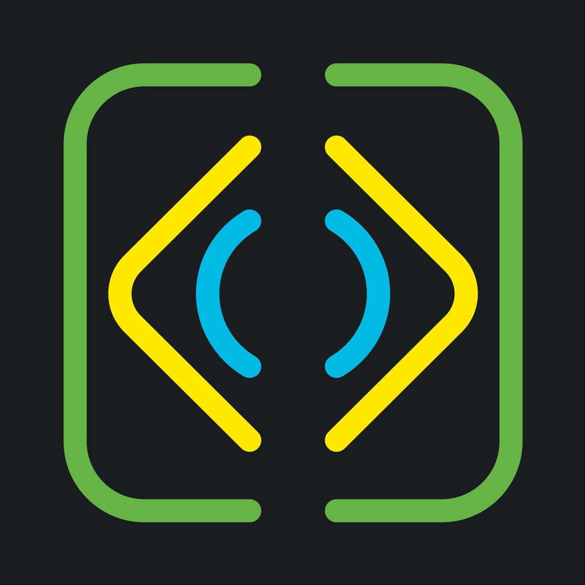

    

    
    
    
     
    

# NSBrazil Conference 2020 🇧🇷

[You can now download the app on the App Store!](https://apps.apple.com/br/app/nsbrazil-2019/id1180455342)

## NSBrazil Conference SwiftUI application!

# Features
* Home to track conference informations
* Talks from past conferences
* List of all talks separated by day and time
* Localized to English

You can use this application to learn about SwiftUI, Combine and contribute to the community. It uses a very standard view, and view model architecture with full use of @State, @Binding, @Published, Observed and Observable object. 
