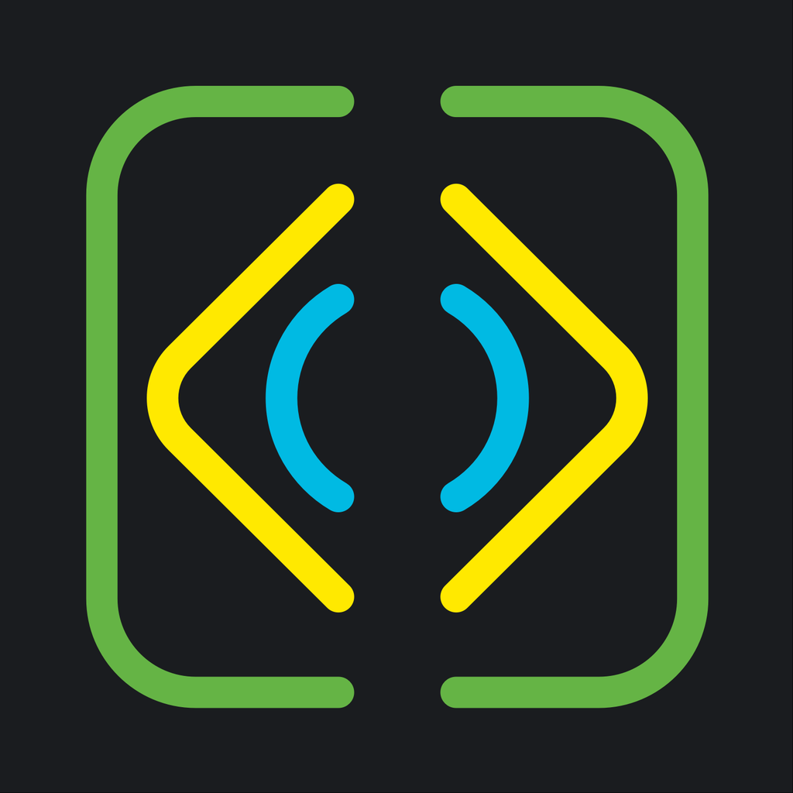
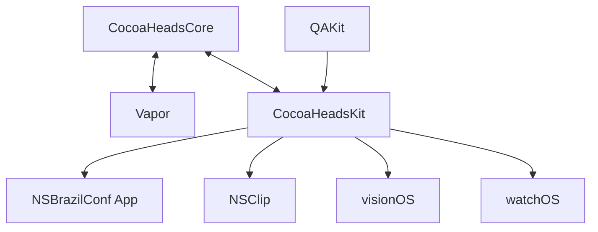

    

    
    
    
     
    

# CocoaHeads Brasil 🇧🇷

The new public attendee experience runs without a backend using the shared **CocoaHeads (Mock)**
scheme. It includes city filtering, upcoming and past events, ongoing-event actions, event details,
and persistent offline content. iPhone, iPad, Mac Catalyst, and visionOS share the same SwiftUI screens.

See [the app foundation guide](docs/app-foundation.md) for schemes, server configuration,
mock scenarios, the public screen contract, and validation commands. The existing CloudKit Q&A
feature remains available; backend deployment and database setup are separate work.

The **Buscar** tab searches the shared catalog and stays empty until the user types. The **Perfil**
tab currently shows the organizer entry card; only the word **Entre** opens an **Entrar** placeholder.
The Apple sign-in client, local preview accounts, organizer workspace, and publishing API are
implemented, but sign-in is intentionally disconnected from that entry point for now. The publishing
foundation restricts organizers to assigned chapters and gives admins access to every chapter.
See [organizer setup](docs/organizer-setup.md) for the remaining connection work, migrations,
Apple credentials, manual access SQL, and the publishing API.

## Previous conference application

[You can now download the app on the App Store!](https://apps.apple.com/br/app/nsbrazil-2019/id1180455342)

## NSBrazil Conference SwiftUI application!

# Features
* Home to track conference informations
* Talks from past conferences
* List of all talks separated by day and time

You can use this application to learn about SwiftUI, Combine and contribute to the community. It uses a very standard view, and view model architecture with full use of @State, @Binding, @Published, Observed and Observable object.

## Dependency Graph

```mermaid 
flowchart TD

CocoaHeadsCore <--> Vapor
CocoaHeadsCore <--> CocoaHeadsKit
QAKit --> CocoaHeadsKit
CocoaHeadsKit --> app[NSBrazilConf App]
CocoaHeadsKit --> NSClip
CocoaHeadsKit --> visionOS
CocoaHeadsKit --> watchOS
```
