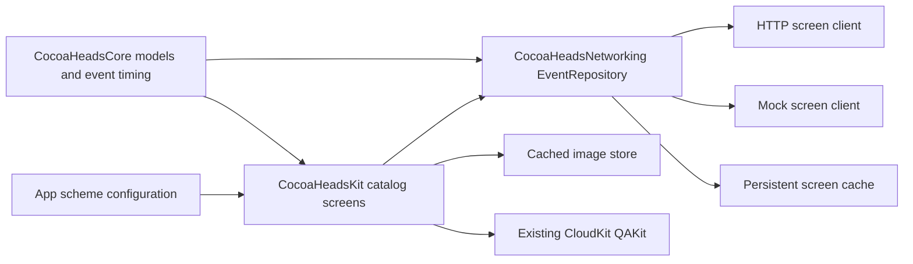

# Public attendee foundation

The app now opens a public event catalog instead of the legacy CloudKit home. This first slice
implements the attendee experience on iPhone, iPad, Mac Catalyst, and visionOS. Registration opens
the event's external page. Account and organizer foundations are also included; the signed-out
profile entry deliberately opens a placeholder while its Apple sign-in screen remains disconnected.
See [organizer setup](organizer-setup.md) for that boundary and the publishing API. Videos, saved
events, and raffle rewrites are deferred. The Watch and App Clip entry points remain unchanged.

## Run the app

Open `NSBrazilConf.xcodeproj` and select a shared scheme:

| Scheme | Run / Test | Archive / Profile |
| --- | --- | --- |
| CocoaHeads | Production server | Production server |
| CocoaHeads (Localhost) | Local HTTP server | Production server |
| CocoaHeads (Mock) | In-process fixtures | Production server |
| CocoaHeadsBR Vision | Production server | Production server |
| CocoaHeadsBR Vision (Localhost) | Local HTTP server | Production server |
| CocoaHeadsBR Vision (Mock) | In-process fixtures | Production server |

`NSBrazilConf` remains a production scheme so existing Xcode Cloud workflows keep their scheme.
Localhost and Mock use `Debug-Localhost` and `Debug-Mock`; archives use `Release`. Release ignores
debug process overrides and always selects the production environment. The app does not silently
substitute fixtures when server configuration is missing or a request fails.

Set the real public origin in `Configuration/Server.xcconfig` when it is ready:

```xcconfig
COCOAHEADS_PRODUCTION_URL = https:/$()/your-service.onrender.com
```

The `$()` separates the slashes because `//` starts an xcconfig comment. The production setting
is intentionally empty until the owner supplies the Render URL. No Render or database changes
are included. The default local origin is `http://localhost:8080`. For a physical device, use the
Mac's reachable development-server address through the Debug scheme's `COCOAHEADS_API_URL`
environment variable; device localhost refers to the device itself. The server must listen on
an interface that the device can reach.

## Mock scenarios

In the Mock scheme's Run action, add `COCOAHEADS_MOCK_SCENARIO` as an environment variable:

| Value | Behavior |
| --- | --- |
| `standard` | Default. Multiple cities, ongoing and ended-today events, featured event, past events, and an empty chapter. |
| `empty` | Cities are available, with no events. |
| `offline` | A connection failure; previously cached content remains usable. |
| `serverError` | HTTP failure; cached content or retry state. |
| `malformed` | Invalid supported payload; cached content or retry state. |
| `unsupported` | Unknown screen/version; update-required screen even when cached content exists. |

Mock event dates regenerate relative to the current time on every request, including refreshes
after returning to the foreground. Tomorrow's run still has ongoing, upcoming, and past events.
Belo Horizonte's concurrency event has no end time; its detail shows only the start time.
Run `standard` before `offline` to inspect the persistent cache after relaunch. Use a fresh
simulator for failure states without a cache.
Fixture registration URLs use `example.com`. The catalog gateway and image store perform no HTTP
in Mock mode. Q&A is the deliberate exception: it opens the existing QAKit CloudKit flow unchanged,
using the event's `qaSessionID`. Mock Q&A IDs are illustrative, not seeded CloudKit records.
The Q&A entry card shows decorative sample questions without reading CloudKit until opened.
MapKit manages its own map tiles independently of the catalog gateway; its preview does not
request the user's location. Sample hero images load from the package bundle and enter the
same persistent image cache as real event images. [Mock artwork](mock-artwork.md) records the asset
and generation prompt.

## Architecture and server contract



The request/client split follows the local Joguei reference. Each typed request declares its
expected screen and mock response. Live and mock responses pass through the same envelope decoder
and domain validation before reaching the UI. Backend work can implement the public endpoints
without changing the screens or their state handling.

| Request | `screen` | `content` |
| --- | --- | --- |
| `GET /v1/screens/events` | `eventFeed` | `EventCatalog`: `chapters` and complete `events` |
| `GET /v1/screens/events/{id}` | `eventDetail` | `CommunityEvent` matching the requested ID |

Both requests are public: no account, authorization header, or App Attest is required. The wire
models live in `CocoaHeadsCore/Sources/CocoaHeadsCore/Catalog/EventCatalog.swift`. The envelope is:

```json
{
  "schemaVersion": 1,
  "screen": "eventFeed",
  "content": {
    "chapters": [
      { "id": "curitiba", "name": "Curitiba", "region": "PR" }
    ],
    "events": []
  }
}
```

Dates use ISO 8601, accepting offsets and fractional seconds. Events carry stable IDs, a chapter
ID, a start date, an optional end date, an IANA timezone ID, summary, external registration URL, attendance format,
and optional venue, online link, artwork, talks, additional links, and existing Q&A session ID.
The current envelope describes fixed screens; modular layout rendering can extend the contract
later. An unsupported screen or schema version prompts an App Store update. Invalid JSON or
invalid content in a supported screen is a retry/cache case, not an update demand.

The feed initially shows all cities, then remembers the chosen chapter. Search covers event
titles, chapter names, talk titles, and speakers in a dedicated **Buscar** tab. Its role is `.search`
on iOS 26 and `.prominent` on 27. The tab shows no catalog content until the query contains a
non-whitespace character; clearing it hides the results again. Eventos and Buscar share an observable
catalog loader that coalesces loading and refreshes, so typing filters existing data without a request
for each query. Their navigation and query state are separate.

Ongoing events use one outer card containing their
hero, directions, and a compact faded Q&A preview. Regular horizontal size class places the hero
on the left and directions plus questions on the right; directions remain expanded with no collapse
control. Compact size class stacks the content and offers a faded map button to expand arrival details.
The hero still opens the full event program.

Individual chapter pages show current/upcoming events followed by a separated past-events section,
without a period picker. This complete timeline includes ongoing and featured events as ordinary rows.
The national page retains Próximos/Passados, excludes ongoing events from its ordinary rows, and keeps
the ongoing cards and featured carousel above the picker. Featured events remain in its ordinary list.
Highlights still follow chapter selection and search. An event remains current, labelled as ended,
until the beginning of the calendar day after its final day in the event's timezone. This applies
to cross-midnight and multi-day events as well. Only then does it move to Passados. With no end
time, it remains ongoing from its start until the next midnight in its own timezone; the app
does not invent an end time.

The same detail screen and hero component serve ordinary, featured, and ongoing events. The optional
`imageURL` becomes the hero background, with a contrast gradient; events without artwork retain
the green fallback. A venue's optional `arrivalInstructions` provides directions such as entrance,
floor, and transit notes. Apple Maps is the primary routing action. Google Maps and Waze appear
only when `canOpenURL` finds their registered schemes (`comgooglemaps` and `waze`). Both app targets
declare these under `LSApplicationQueriesSchemes`. Destinations use valid coordinates when supplied,
otherwise the address; missing coordinates never become a guessed map pin. See the official
[Google Maps URL scheme](https://developers.google.com/maps/documentation/urls/ios-urlscheme) and
[Waze deep links](https://developers.google.com/waze/deeplinks) references.

A chapter without upcoming events presents a help card followed by all upcoming and ongoing events
elsewhere in Brazil, then that chapter's past events. Its own editorial features remain visible above
this sequence.
“Quero palestrar” and “Quero contribuir” open sheets containing `CocoaHeadsPlaceholder`;
there are no forms or contact submissions yet. Use `CocoaHeadsPlaceholder("Feature name")` for
other unfinished destinations and search that symbol to find all such call sites.

Featured content is independent of events: the catalog carries an ordered `features` array with
chapter ownership (`chapterID`, or `null` for the national organization), title, optional subtitle
and image, and a typed destination. Destinations can open an event, an external URL, or an unfinished
native destination using `CocoaHeadsPlaceholder`. A chapter displays its own features in editorial
order. The national horizontal carousel selects the first feature of each chapter plus every
national feature, preserving server order. Selection happens before search filtering, so search does
not silently promote another chapter feature. Old catalogs without `features` remain readable;
legacy `isFeatured` events provide a fallback only when no explicit editorial features are supplied.

Valid screen responses are stored on disk and displayed immediately on later visits while a
refresh runs. Complete feed events seed the detail cache. Ordinary refresh failures keep that
content and show the last successful update time with a retry action. Unsupported screens bypass
stale fallback. Downloaded images are cached too. Caches are isolated by environment and server
origin; Mock scenarios share a namespace so offline scenarios can reuse Standard data. The OS can
reclaim the cache. See `CocoaHeadsNetworking/README.md` for storage and transport details.

## Validation

```sh
swift test --package-path CocoaHeadsCore
swift test --package-path CocoaHeadsNetworking
xcodebuild -project NSBrazilConf.xcodeproj -scheme 'CocoaHeads (Mock)' \
  -destination 'platform=iOS Simulator,name=iPhone 18 Pro' \
  CODE_SIGNING_ALLOWED=NO ENABLE_PREVIEWS=YES test
```

The shared test plan includes core timing, networking/cache, feed behavior, and the existing
Common/QAKit tests. Networking tests use injected transports and temporary caches and make no
external requests. `ENABLE_PREVIEWS=YES` skips the repository's existing build phase that rewrites
all Swift files before linting; format/lint changed Swift sources separately when using this flag.

Before extending the UI, exercise all cities, an empty chapter, search, past events, ongoing
actions, detail navigation, light/dark appearances, and accessibility text sizes. Verify cached
content after relaunch in `offline` and the update screen in `unsupported`. Use native platform
navigation and materials; visionOS uses its own supported prominent button style.

The initial implementation passed the shared iOS test plan, iOS Simulator builds, a visionOS
device build, and a Mac Catalyst build with Xcode 27. iPhone and iPad screenshots verified the
feed, offline/update states, and accessibility layout. The running Catalyst app verified chapter
selection, empty/past results, and detail navigation. A visionOS simulator runtime was not installed,
so its runtime appearance still needs an on-device or simulator review. No live backend was exercised.

The refinement pass also passed the shared iOS test plan and all three platform builds. New checks
cover missing end times and local-midnight transitions, refreshing the same mock repository on
later days, bundled image caching without HTTP, directions URL encoding and incomplete coordinates,
and national event suggestions. iPhone/iPad screenshots verified the hero, map, and faded Q&A card
in light/dark appearance; the Catalyst app verified the help sheet and past-event access for a
chapter with no upcoming events. Third-party map app routing still needs a device with those apps
installed; availability checks intentionally hide them on the test simulators.

The unified-card/editorial-content pass adds projection coverage for chapter timelines across both
national picker states, first-per-chapter feature selection, mixed event/external/placeholder
destinations, editorial ordering before search, and legacy catalogs. The running iPhone/iPad
previews verified stacked and side-by-side ongoing cards; Catalyst verified the chapter timeline,
quiet-chapter content order, and a national non-event feature opening its placeholder sheet.

The current search-tab pass passed the shared iOS test plan (103 tests), Mac Catalyst and visionOS
builds, and targeted Swift formatting checks. Shared catalog tests cover tab cancellation, load reuse,
and offline/unsupported refresh behavior. The running Catalyst app verified that an empty query shows
no content, typing displays matching events, and clearing the field hides those results. iOS 26's tab
role fallback compiled; runtime checks used the available iOS 27 simulator.
